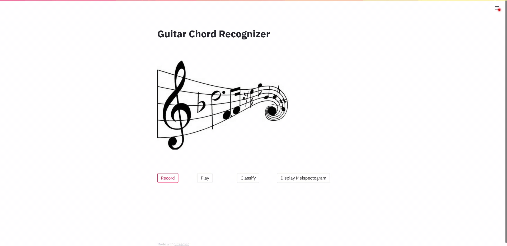
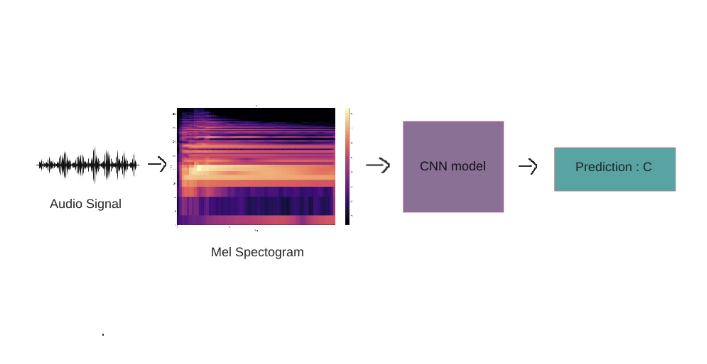

# Guitar-Chord-Recognizer
An application that recognizes a chord played on a guitar.

## Requirements and Dependencies
Clone the repository and install the dependencies using pip package manager.
```
python3 -m pip install -r requirements.txt
```

## Run
```
cd src
streamlit run app.py
```

## Demo


## Inference
The chord played on a guitar is recorded and converted into a [MelSpectogram](https://medium.com/analytics-vidhya/understanding-the-mel-spectrogram-fca2afa2ce53). The spectogram 
is then fed into a CNN that predicts the chord.




## Limitation
* The dataset had a collection of ten different chords, so the model is only capable to recognize those chords. The chords are : **'a', 'am', 'bm', 'c', 'd', 'dm',
'e', 'em', 'f' and 'g'**.


## Download the dataset
```
cd input
./download.sh
```
